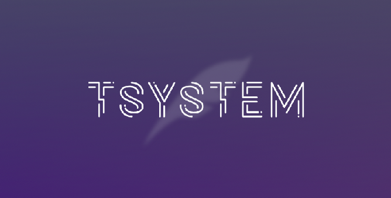

# tsystem-installer


[tsystem](https://github.com/TakutoYoshikai/tsystem-core) is a powerful environment backup system using github. 

### Requirements
* Ubuntu 20.04

### Usage
```bash
bash <(curl -sL https://bit.ly/3y63bdG)
```

### Contributing

Contributions are what make the open source community such an amazing place to learn, inspire, and create. Any contributions you make are greatly appreciated.

If you have a suggestion that would make this better, please fork the repo and create a pull request. You can also simply open an issue with the tag "enhancement". Don't forget to give the project a star! Thanks again!

1. Fork the Project
2. Create your Feature Branch (git checkout -b feature/AmazingFeature)
3. Commit your Changes (git commit -m 'Add some AmazingFeature')
4. Push to the Branch (git push origin feature/AmazingFeature)
5. Open a Pull Request


### LICENSE 
MIT LICENSE
